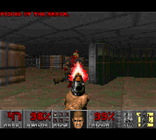

# Doom on the Chromatic

`--with-doom` replaces the Game Boy core with a VexRiscv SoC that runs Doom
([doomgeneric](https://github.com/ozkl/doomgeneric), Chocolate Doom based) from the PSRAM, on the
Chromatic LCD (and so over UVC), with the console buttons and sound effects.

Status: **runs on the Chromatic** (title, demos, menus, playable with the console buttons), at
**~3.5-4.5 fps** (demo, firmware frames counter); also on the PC (SDL emulation of the Chromatic, same
platform code) and in `litex_sim` (frame below).



Performance (hardware, `firmware/fbtest`): main RAM 32-bit writes 6.6MB/s, reads 6.8MB/s, memcpy
2.2MB/s, random read (cache miss) latency 3.4us (~114 CPU cycles). In `litex_sim` (single-cycle RAM)
the demo takes ~5M CPU cycles per frame (~6-7 fps at 33.5MHz): the PSRAM latency costs ~40%.

## SoC (`./chromatix.py --with-doom`)

| | |
|---|---|
| CPU | VexRiscv `standard` (rv32im, 4KB I$/D$, single-cycle mul), 33.5MHz (pClk, Fmax 61MHz) |
| Boot | no ROM: the CPU starts at the main RAM start, held in reset (ctrl `cpu_rst`) while the host loads the firmware |
| Main RAM | PSRAM 0x080000-0x7FFFFF (7.5MB) at 0x40000000, behind an 8KB L2 cache (8-byte lines) |
| LCD | `LCDFramebuffer`: 160x144 8-bit indexed + 256 colors RGB555 palette (BSRAM, Wishbone at 0x90000000), Game Boy LCD stream into the video pipeline (OSD, color correction, panel, UVC) |
| Audio | `PCMAudio`: stereo 16-bit samples FIFO (512) at 11025Hz, IRQ when less than half full |
| Buttons | `demo_buttons_status` |
| Host link | USB CDC: UARTBone (fast loads, ~MB/s) + crossover UART (console, `litex_term crossover`) |
| Resources | Logic 57%, BSRAM 55/56 |

Main RAM layout (`firmware/common/main_ram.ld`): firmware (code/data/bss) from 0x40000000, heap
(Doom zone: 2MB) and stack (64KB) up to 0x40370000, then the WAD (up to 4.06MB: shareware
`doom1.wad`).

## Build and run

```bash
# Bitstream (also compiles the firmware libraries: full picolibc, no BIOS).
./chromatix.py --gowin-path ~/tools/gowin_1.9.12.04/IDE --with-doom --build --flash

# Firmware.
make -C firmware/doom   # doom.bin
make -C firmware/fbtest # Bring-up: main RAM benchmark, LCD patterns, buttons, PCM tones (A/B).

# Load and start (WAD repacked with 4-byte aligned lumps: used in place by the firmware).
litex_server --uart --uart-port /dev/ttyACM0 &
./scripts/chromatic.py run firmware/doom/doom.bin --wad doom1.wad
litex_term crossover   # Console (Doom output, frames rate every 5s).
./scripts/chromatic.py capture doom.png --size 320x288
```

The shareware `doom1.wad` is freely distributable but not included.

## Controls

| Button | Game | Menus |
|---|---|---|
| D-pad | move/turn | navigate |
| A | fire | select / yes |
| B | use (doors, switches) | back |
| Start | menu | close |
| Select (alone) | automap | |
| Select + Left/Right | strafe | |
| Select + Up/Down | next/previous weapon | |

Always run. The Menu button is left to the ESP32 menu.

## Display

Doom renders 320x200 (shown 4:3 on a CRT): the LCD shows 160 columns (1 out of 2) and 120 lines
(4:3 aspect ratio, letterboxed), `DISPLAY_LINES=100` (1 out of 2) or `144` (full height) at build.

## Firmware check in litex_sim

The SoC firmware runs without the Chromatic peripherals (LCD in RAM, dumped on the console at frame
`LCD_DUMP_FRAME`, no buttons/audio), in LiteX's simulator with the WAD preloaded in the main RAM:

```bash
litex_sim --cpu-type vexriscv --cpu-variant standard --integrated-main-ram-size 0x800000 \
    --libc-mode full --output-dir doomsim --no-compile-gateware   # Software/headers.
make -C firmware/doom BUILD_DIR=$PWD/doomsim DOOM_OPT="-O2 -fbuiltin -w -DLCD_DUMP_FRAME=60"
# regions.json: {"doom1_aligned.wad": "0x40370000", "firmware/doom/doom.bin": "0x40000000"}
litex_sim --cpu-type vexriscv --cpu-variant standard --integrated-main-ram-size 0x800000 \
    --libc-mode full --output-dir doomsim --ram-init regions.json --non-interactive
```

(the aligned WAD comes from `align_wad()` in `scripts/chromatic.py`; `make clean` when switching
between the SoC and simulation builds; ~10 minutes to frame 60).

## PC build (port development)

```bash
make -C firmware/doom -f Makefile.host
DOOM_WAD=doom1.wad firmware/doom/doom_host  # Keys: arrows, X: A, Z: B, Enter: Start, Backspace: Select.
```

`hal.h` abstracts the hardware: `hal_litex.c` (SoC) and `hal_sdl.c` (PC: 160x144 window, keyboard/
gamepad, SDL audio); `chromatix_dg.c` (display/input/WAD) and `sound.c` (mixer) are shared.

## Implementation notes

- doomgeneric changes (`git log -- firmware/doom/doomgeneric`): `DOOMGENERIC_DIRECT` (frame read
  from `I_VideoBuffer`, palette to `DG_SetPalette`), `DOOMGENERIC_MEMWAD` (WADs in memory, opened as
  mapped files: lumps used in place, not copied in the zone), `DOOMGENERIC_NO_SDL_MIXER`.
- Sound: 8 channels software mixer of the DMX lumps (8-bit, 11025Hz) refilling the PCM FIFO from its
  interrupt (independent of the frames rate). No music (MUS/OPL).
- No filesystem: no config/savegames.
- `dg_frames` (firmware global, see `doom.elf.map`): frames counter, readable from the host over the
  bridge (frames rate without the console).

## Known issues / next

- Performance: reduce the PSRAM miss latency (3.4us: request/acknowledge clock domain crossings,
  arbitration, 8-byte L2 lines: longer bursts/lines), larger CPU caches (BSRAM is full: 55/56, the
  framebuffer could move to the PSRAM), `-O3`, low detail mode, CPU frequency (pClk Fmax 66MHz).
- Tearing: the LCD framebuffer is updated while displayed (no double buffering): wait for the vsync
  (`framebuffer_frame`) or double buffer.
- Host link: `litex_server` can get out of sync when a client is killed during a transaction (reads
  return 0 or time out): restart it. Long read-backs (`run` verification) were seen stalling: use
  `--no-verify` for now (writes: ~2.3MB/s, WAD loaded in ~2s).
- Console: the crossover UART output is dropped when the host doesn't read it fast enough (the
  firmware never blocks on it).
