# Chromatic SDR (2.4 GHz)

Goal: a portable SDR from the Chromatic, using [ESP-SDR](https://espargos.net/espsdr/)
([esp-sdr](https://github.com/ESPARGOS/esp-sdr), GPL-3.0): an undocumented ESP32 modem debug path
captures raw I/Q samples from the ESP32 radio, without extra hardware. The console adds the screen,
buttons, FPGA processing and a USB 2.0 link to the PC.

Credits: [ESP-SDR](https://espargos.net/espsdr/) is the work of [ESPARGOS](https://espargos.net/)
(Florian Euchner): the raw I/Q capture of the ESP32 radio, its firmware and protocol (and the
[ESP-WebSDR](https://github.com/ESPARGOS/esp-web-sdr) viewer) are the foundation of everything here;
ChromatiX adds the Chromatic transport/tuning (`firmware/esp32-sdr`, a patch of ESP-SDR) and the
console/PC side.

What to expect: a **1.78-2.89 GHz** receiver (2.4GHz ISM, LTE/DECT bands: spectrum, waterfall,
band scan, and decoding tools: LTE cell scanner, BLE scanner, signal identification/drone alert,
DECT, 802.15.4, hunt), not a wideband SDR (no broadcast FM/AM). Captures are bursts (low duty
cycle), not continuous.

## Phase 0: feasibility (done)

- **ESP32**: original ESP32 (revision 3, dual core 240MHz, embedded 4MB flash, 40MHz crystal; chip ID
  0 in the flash image), supported by ESP-SDR (UART transport, GPIO1/GPIO3 = UART0).
- **Install**: prebuilt ESP-SDR image (`esp32` variant, commit 550fade, checksums from the
  [installer manifest](https://espargos.net/espsdr/app/firmware/manifest.json)) written with
  `esptool` through the ChromatiX USB CDC <-> ESP32 bridge (standard bitstream), after a full backup
  of the ModRetro firmware (identical to the 2026-09-30 dump):

  ```bash
  esptool.py --port /dev/ttyACM0 --chip esp32 --baud 460800 read_flash 0 0x400000 esp32_backup.bin
  esptool.py --port /dev/ttyACM0 --chip esp32 --baud 460800 write_flash --flash_mode dio \
      --flash_freq 40m --flash_size 2MB 0x1000 0-bootloader.bin 0x8000 1-partition-table.bin \
      0x10000 2-esp_sdr.bin
  # Restore: esptool.py ... write_flash 0 esp32_backup.bin
  ```

- **Protocol** (2 Mbaud through the bridge, DTR/RTS released: they drive the ESP32 EN/IO0):
  `CAPS SPEC SPECN SPECCAPS SPECSTAT DCT UARTBAUD RXLIMITS SERIALLEASE TUNEEXT RX40 RX16 LPFANA GAIN
  HWAGC IQ8`, gain 0-72, rates 80/40/16 MS/s, 8/10-bit I/Q, tuning 100-6000 MHz accepted (but
  only the Wi-Fi channel frequencies really tune, see the verification section), snapshot spectra
  256-2048 bins (`SPECINFO?`). `CAP16 4096 1` (40 MS/s): `DATA 4096 <crc> 104` (104us of
  capture), 8KB payload.
- **Reception** through the console's ESP32 antenna: the nearby access points are all on Wi-Fi
  channel 1 (2412 MHz). Over 60 captures, channel 1 shows ~10 dB more max-hold/average energy across
  its 20 MHz than channel 11 (no access point), and Bluetooth-like bursts around 2398 MHz.

  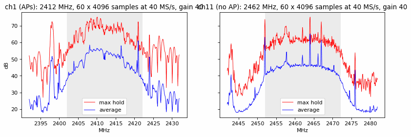

  Band sweep (40 MS/s captures, AGC: levels differ between 20 MHz segments; the narrow regularly
  spaced lines are likely internal spurs, to be characterized):

  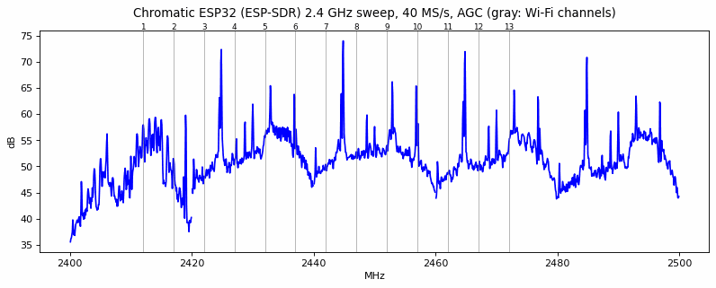

- **USB bridge limitation** (standard bitstream): at 2 Mbaud, ~1 capture in 12 loses a few bytes
  (CRC error) and the throughput is ~31KB/s: the CDC bridge FIFO (64 bytes) overflows when the host
  doesn't poll fast enough. Fine for tests (retries), not for streaming: the console design reads the
  ESP32 directly (FPGA UART, QSPI).
- **ESP32 duties** in the console ([ModRetro MCU firmware](https://github.com/ModRetro/oss-chromatic-console-mcu)):
  menu/OSD (QSPI writes to the FPGA PSRAM: 40MHz quad, 11-bit command, 32-bit address, CS GPIO5,
  CLK GPIO18, D0-D3 GPIO23/19/22/21), settings/config to the FPGA (UART1 115200, GPIO9 TX / GPIO10
  RX), power management (light sleep, wake-up on the FPGA UART), I2S (GPIO33/25/26/27). With ESP-SDR,
  these are not available (no menu/OSD); the SDR ESP32 firmware (phase 2b) keeps what the console
  needs.

## Phase 1: CPU application SoC (done)

`--with-app` (ported from the `doom` branch): VexRiscv (8KB I/D caches) at 67MHz, 7.5MB PSRAM main
RAM (16KB L2), tear-free PSRAM framebuffer, PCM audio, buttons, and a CPU UART to the ESP32 UART0
(`esp32_uart`, 2 Mbaud, 512-byte RX FIFO). Gowin build: logic 69%, BSRAM 48/56, timing met at 67MHz.
`firmware/fbtest` checks the framebuffer/buttons/audio on the hardware.

## Phase 2a: I/Q over the ESP32 UART (done)

The CPU drives ESP-SDR directly (`firmware/sdr/esp32sdr.c`: `FREQ`/`GAIN`/`CAP16`, CRC32 check,
resync on errors): 50/50 CRC-valid 4096-sample captures in a row, 122KB/s (the USB bridge losses
are gone). A 4096-sample capture takes ~67ms (41ms for the 8KB transfer at 2 Mbaud): the stock
ESP-SDR UART is limited to 2 Mbaud (`BAUD 1000000|2000000`), faster needs the ESP-SDR fork (phase 2b).

## Phase 3: SDR application (done, UART version)

`firmware/sdr` (`make BUILD_DIR=../../build`, then
`scripts/chromatic.py --serial /dev/ttyACM0 run firmware/sdr/sdr.bin --no-verify`):

- **DSP** (`dsp.c`): 512-point int32 FFT (Q15 twiddles, tables from `gen_tables.py`), per-segment DC
  removal, Hann window, 8 segments averaged per capture (4096 samples), 1/4 dB log. Checked against
  numpy (same peak bin, dB shape correlation 0.9999).
- **Display** (`lcd.c`, 160x144, 8-bit palette): header (frequency, span, gain, reference level,
  peak frequency/level, update rate), spectrum (60dB, 10dB/10MHz grid, peak hold), Wi-Fi channel
  numbers (20MHz bands of channels 1/6/11/14), BLE advertising channels 37/38/39, waterfall (heat map
  scaled from the noise floor: median of the center half, ESP32 RX filter passband).
- **Controls** (first version, see the handheld UI section for the current one): Left/Right: tune
  (Wi-Fi channels), Up/Down: reference level (5dB), A: span (16/40MHz), B: gain (AGC, manual
  20-70), Start: peak hold, Select: auto reference level, Menu: RSSI tone (PCM audio, pitch
  following the peak level above the noise floor in the center
  quarter of the span: tune to an emitter and hunt it down; measured over the USB audio:
  520-1120Hz following Wi-Fi bursts).
- **Measured**: 9.5 updates/s (capture 67ms, DSP 30ms, draw 6ms, present 2ms), no capture errors
  after the startup resync. 80MS/s gives no wider view (the ESP32 RX filter is ~40MHz wide, its CAPS
  only list RX40/RX16), so the spans are 16 and 40MHz.

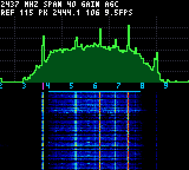

Wi-Fi channel 6 band (2437MHz, AGC) on the console: the ~36MHz RX filter passband and the regular
narrow lines (internal spurs, also seen in phase 0) are visible in the spectrum and waterfall.

## Phase 2b: I/Q over QSPI (done)

`firmware/esp32-sdr`: ESP-SDR (GPL-3.0, fetched and patched at build time) with a Chromatic
transport. `QSPI <address>` makes the captures go to the FPGA PSRAM over the ESP32 -> FPGA QSPI
link (the ModRetro menu/OSD link: VSPI 40MHz quad, 1KB transfers written as PSRAM bursts by the
existing gateware), only the `DATA` header on the UART. No gateware change: the CPU invalidates its
caches and reads the payload from its main RAM (CRC checked).

- `CAP16 16380` round trip: 7.3ms (vs ~170ms over the UART).
- Console app: 4096-sample captures in 10ms, **25.6 -> 27 updates/s** (DSP: int16 block scaled FFT,
  21ms per update), no CRC errors.

## Phase 4: I/Q streaming to the PC, SoapySDR (done)

The console relays the ESP-SDR protocol to the PC at the USB rate:

- **Gateware** (`chromatix/gateware/cdc_link.py`, `--with-app`): the USB CDC byte stream is
  switched by the application from the UARTBone debug bridge to an application UART (commands,
  replies) + a DMA reader (bulk data from the main RAM). A host "1200 baud touch" switches it back
  to the debug bridge (`scripts/chromatic.py` does it) for the debug session: back to the
  application 1s after the port is closed (DTR released). Build: logic 74%, BSRAM 50/56, timing
  met.
- **Firmware** (`firmware/sdr`): host command lines forwarded to the ESP32 (`BAUD`/`QSPI` answered
  locally), replies relayed; after a capture `DATA` header, the payload (already in the main RAM
  through QSPI) is sent by DMA. The relayed captures are displayed (header: `USB`), local captures
  resume 2s after the last host command.
- **Host**: `scripts/chromatic_sdr.py` (info, bench, spectrum, record) and a SoapySDR module
  (`software/SoapyChromatic`: GNU Radio, gqrx, SoapySDR Python..., CS8/CS16/CF32, 16/40MS/s, AGC
  or manual gain). The official SoapyESPSDR is ESP32-S31/Ethernet only.
- **Measured**: 73 captures/s of 16380 samples, **2.4MB/s** (1.2MS/s delivered, ~3% duty cycle at
  40MS/s), 0 errors over 833 relayed captures (27MB); stock ESP-SDR through the USB bridge: 31KB/s.
  SoapySDR: 1.0MS/s (Python), GNU Radio soapy source: 1.12MS/s.

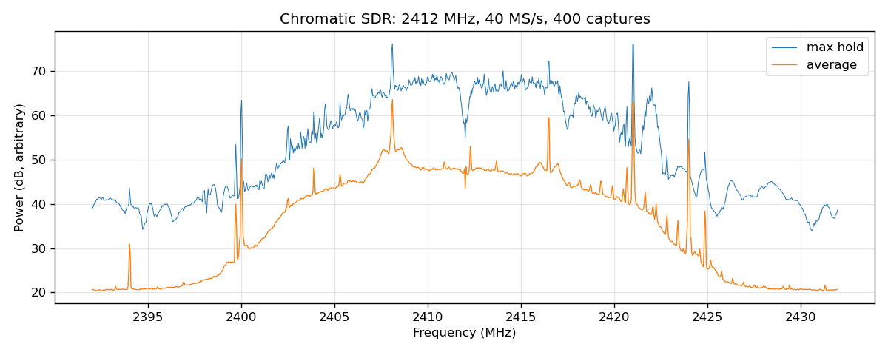

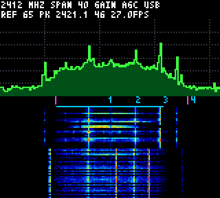

Host spectrum (400 relayed captures, `chromatic_sdr.py spectrum --freq 2412`): Wi-Fi channel 1
(20MHz, max hold) and the console showing the same captures (`USB`).

## Verification: tuning, spectrum orientation, console vs host

Reference signals: the console 24MHz crystal harmonics (2400/2424/2448/2472/2496MHz, narrow lines
seen at every tuning) and the Wi-Fi access point on channel 1.

- **Inverted spectrum**: with ESP-SDR's I/Q order, the crystal harmonics showed at 2*LO - f (ex:
  2424MHz at 2420/2430/2440MHz for LO = 2422/2427/2432MHz). The ESP32 spectrum is inverted: the
  samples are conjugated by the console DSP, SoapyChromatic and `chromatic_sdr.py` (the ESP-SDR
  protocol/payload is unchanged).
- **Tuning range** (stock ESP-SDR, see the extended tuning section for the fix): ESP-SDR accepts
  100-6000MHz, but on the original ESP32 only the Wi-Fi channel frequencies (2412-2472MHz in 5MHz
  steps, 2484MHz) move the LO: out of channel requests (calibration on 2412MHz then direct PLL
  offset) leave it in place, except a few MHz around 2412MHz (comb positions unchanged from 2405MHz
  down to 2300MHz, from 2490MHz up to 2600MHz, and for most frequencies between channels). ESP-SDR
  documents its extended range as not RF-validated. With stock ESP-SDR, the console steps through
  the channels and SoapyChromatic tunes the nearest channel + digital mixer (2410-2486MHz).
- **Checks after the fixes**:
  - Host (SoapyChromatic) at 2410/2412/2414.7/2425.3/2437/2439.9/2451/2463.6/2478/2484/2486MHz:
    every crystal harmonic in the span at its true frequency (2400.02, 2424.00, 2448.00, 2472.00,
    2496.00MHz).
  - Console standalone display (UVC frames, spectrum trace read per column) at 2412/2437/2462MHz:
    harmonics at 2400.1/2424.1, 2424.1/2448.1, 2448.1/2472.1MHz (0.25MHz columns).
  - Console display of relayed captures vs host computation of the console DSP on the same
    captures: same lines within one column, trace correlation 0.82.
  - Access point bursts (waterfall/burst spectra) at LO 2422MHz: 2414.8MHz center on the console,
    2415.1MHz on the host, 2414.5MHz through the host NCO (LO 2419.5MHz, ESP32 on 2417MHz): same
    absolute frequency, on the AP side (an inverted spectrum would show them at ~2429MHz).
  - gqrx 2.15.8 (Xvfb, remote control) at 2436MHz (hardware frequency 2433.12MHz): lines at
    2424.0/2424.3, 2441.1 and 2448.0MHz on its axis.

## Extended tuning: 2386-2504MHz in 1kHz steps (ESP32 fork)

ESP-SDR's out of channel tuning (2412MHz calibration + direct PLL divider) leaves the VCO capacitor
bank calibrated for 2412MHz: the LO doesn't follow. The ESP32 PHY library has a software channel
calibration (`set_chan_freq_sw_start(index = MHz - 2400, offset, ctrl)`, used for the Wi-Fi
channels by `set_channel_rfpll_freq` and by the Bluetooth PHY for its 1MHz channels), found by
disassembling `libphy.a`. `firmware/esp32-sdr` (`chromatic_tune.c`) uses it:

- **Calibration on the requested MHz** (index 0-84: 2400-2484MHz; no lock above 85) + an offset
  for the fraction. The offset is in 1/1024 MHz units but the LO moves by **1.0546x** the offset
  (measured, interpolated comb peaks).
- **Beyond, offsets from the 2400/2484MHz calibrations**, same 1.0546 scale, with a -0.243MHz step
  past a 15MHz move above 2484MHz (overlapping regions: switched at 14.9MHz). PLL lock from 2400 -
  14.7MHz to 2484 + 22MHz: 2386-2504MHz used.
- **Result**: `FREQK <kHz>` (and `FREQ`): LO within **+-2.6kHz** (~1ppm, the console/ESP32 crystals
  difference is -1.2kHz) at 18 arbitrary frequencies over 2386.3-2503.8MHz, both sides of the
  14.9MHz switch. The comb line at 2400MHz is not a reference: another source sits ~16kHz above it
  (at LO 2412MHz: -17kHz from it, -1.3kHz from 2424MHz).
- **Clients**: the console tunes 2386-2504MHz (5MHz steps, kHz from the host), SoapyChromatic and
  `chromatic_sdr.py` use `FREQK` (range from `RANGEK?`, NCO only for the sub-kHz rest); stock
  ESP-SDR: channel frequencies + NCO. Checked: SoapySDR (comb lines at their true frequencies at
  2386.7-2503.5MHz), console standalone at 2387.0/2388.5/2453.5/2502.0/2503.5MHz (UVC trace),
  gqrx at 2390.5MHz (hardware 2387.62MHz: lines at 2376.0/2400.0MHz on its axis). The console
  reference level now follows the level changes across the band (auto until Up/Down).
- **1090MHz/ADS-B**: not reachable with the ESP32 radio (LO range above, 2.4GHz antenna path).
  The ESP32 ADS-B projects use an RTL-SDR dongle on an ESP32-P4 USB host or a dedicated 1090MHz
  module; a video of an ESP32 SDR app "at 1575MHz" shows a 2.4GHz spectrum with the hardware at
  2446.5MHz (the app warns: outside its verified ranges). An external front-end (cartridge slot)
  would be needed.

## Tuning beyond the frequency table: 2150-2880MHz (VCO range) and 80MS/s wide view

All the ways tried to move the radio further (ESP32 fork debug commands: analog registers
`I2CR/I2CW/I2CD`, registers `REGR/REGW`, PLL table `FTAB`, raw calibration `TUNESW`; references:
console crystal harmonics, verified with 2-4 lines at 80MS/s against wrong-LO hypotheses):

- **PLL frequency table** (85 entries, 2400-2484MHz: the table address is `index*3` on 8 bits):
  word 0 = VCO capacitor bank code (analog block 0x62 reg 1), word 1 = divider (LO = 480MHz *
  (2 + word/2^20): any frequency from 960MHz up can be encoded), word 2 = front-end tuning. A
  borrowed entry loaded with the target divider and a capacitor code close to the result (fit of
  the calibration results: +-1.6) makes the PHY calibration lock **from 2150 to 2880MHz**
  (repeatable; the capacitor code reaches 1 at 2880MHz). This is now the fork's default tuning
  (`TUNEMODE 1`, `RANGEK 2150000 2880000`): LO within -0.8..-2.0kHz (the crystals difference)
  over 2150.5-2851.4MHz. The 2640MHz line, like 2400MHz (both 40MHz harmonics too), is not a clean
  reference (-20kHz vs -1.4kHz on 2616MHz at the same LO).
- **Below 2150MHz / above 2880MHz**: the calibration fails from every starting code (it ends 11
  codes above its start: no lock found); forcing the capacitor register doesn't lock either (the
  calibration sequence is needed). Register sweeps (block 0x62 regs 2/3/4/7/9/10, bit flips):
  only reg 7 bit 7 (0xc0 -> 0x40, a VCO band bit?) locked 2100MHz once, not reproducible.
- **Wider view without moving the LO**: the ESP32 RX filter opens (`LPF 0`/`BANDWIDTH 67`): at
  80MS/s, comb lines are seen at -34/+38MHz (22dB): **+-38MHz around the LO, ~2112-2918MHz
  observable**.
  New 80MHz span on the console (A), 80MS/s in SoapyChromatic/`chromatic_sdr.py` (filter opened).
- **Front-end**: the noise floor is flat and the comb lines 20-38dB above it over the whole range
  (the console's own harmonics: absolute sensitivity off 2.4GHz is lower, antenna/LNA matched for
  2.4GHz). **Real off-band signals received**: mobile band 1 downlink carriers (sharp blocks up
  to 2170MHz, at 2150MHz) and an LTE band 7 20MHz downlink carrier at 2680MHz (18MHz occupied,
  2671.0-2689.2MHz at LO 2655/2680/2700MHz and 40/80MS/s: an external signal, not an image).
- **Not possible**: 1090MHz (or GPS 1575MHz) directly; a 2nd order response (2*f_RF = f_LO) would
  put 1090MHz at LO 2180MHz, now in range, but the LNA product of an ADS-B signal is far below the
  noise; LO harmonics (3*f_LO = 6.45-8.64GHz) are not usable either.

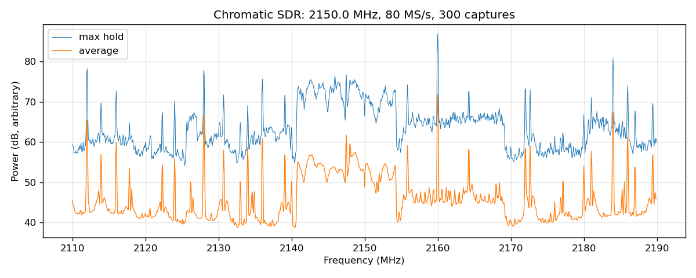

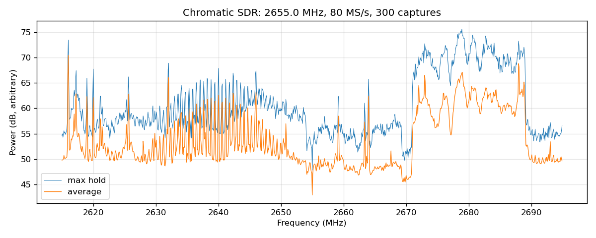

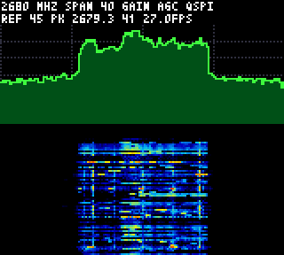 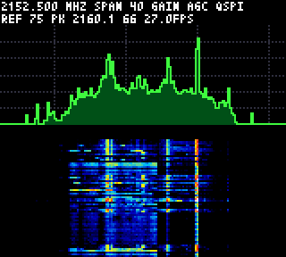

## 5/6 LO mode: down to 1792MHz (eSpDR/ESP-SDR finding)

[h0m3us3r](https://github.com/h0m3us3r)'s [eSpDR](https://github.com/h0m3us3r/eSpDR)
([LO extension](https://github.com/h0m3us3r/eSpDR/blob/main/docs/LO-EXTENSION.md)) found that a
CKGEN selector (analog block 0x65, register 0, bit 4) makes the receive LO **5/6 of the PLL
frequency**; [ESP-SDR](https://github.com/ESPARGOS/esp-sdr) (commit 9cfc5e0, 2026-10-02) qualified
it on the original ESP32 (CKGEN host 4, libphy patched `ram_chip_i2c_*` functions) with an
external signal generator, for 1842-2209MHz with its tuning.

`firmware/esp32-sdr` applies it on top of the table tuning: below 2150MHz, the PLL is tuned to 6/5
of the requested frequency (2150-2580MHz, calibration in normal mode) and the selector is set after
the RX setup (3ms settling): **1792-2880MHz** in total (`LO56` capability), then 1775-2890MHz with
the VCO edges (see below).

- **Accuracy** (console crystal harmonics, interpolated peaks): LO within -1..-4kHz at 1793.5,
  1812.25, 1838, 1866.7, 1897.3, 1931, 1965.4, 2003.1, 2047.7, 2081.25 and 2146.5MHz.
- **Real signal**: a 15MHz LTE band 3 downlink carrier at 1845-1860MHz (at LO 1842MHz, also seen
  at LO 1890MHz: same absolute frequency).
- **Console**: presets LTE B3 DL, DECT, LTE B1 DL (2110-2170MHz now fully covered), overlays B3
  DL/DECT, scan ranges clipped to the tuning range (full: 1775-2890MHz in 18 steps, 1.8G, B3/DECT,
  LTE B1); SoapyChromatic/`chromatic_sdr.py` follow `RANGEK?`.
- Our ESP-SDR base stays pinned (550fade): the newer upstream ESP32 changes (5/6 mode and the PLL
  capacitor release for its own direct tuning) are superseded by the fork's tuning.

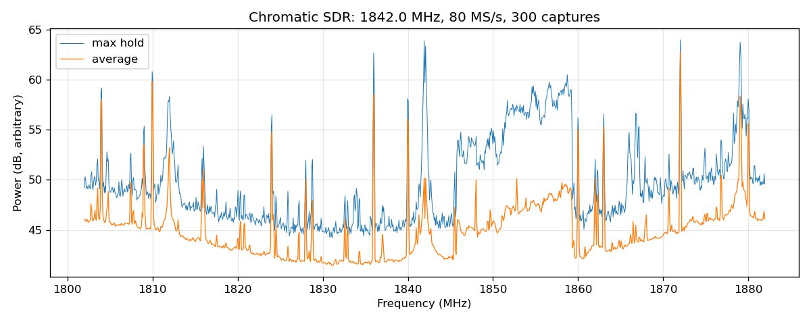

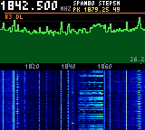 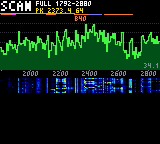

## Range search: VCO edges, LO dividers, 5.8GHz (2026-10-05)

Further range extension attempts on the console ESP32 (references: console crystal harmonics,
LO ratio measured as the baseband shift of the comb lines for a PLL step, wide 80MS/s captures):

- **VCO edges: 1775-2890MHz.** The VCO capacitor word (RF PLL block 0x62 reg 1) has coarse/fine
  nibbles; forcing codes shows the lock window per frequency (~3-5 codes: at 2147MHz low nibble
  10-12, at 2140MHz 12-15, at 2130MHz 15 only with the coarse bits saturated). The VCO locks from
  **2130MHz (code 255)** to **2890MHz (code 0)**: the capacitor bank ends (no 9th bit: reg 2 bit 4
  has no effect). The calibration started from the fitted code finds a locking code up to both
  edges: table tuning **2130-2890MHz**, with the 5/6 LO **1775-2890MHz** (`RANGEK 1775000 2890000`).
  Measured: LO within -0.5..-2.8kHz at 2131.5-2152.6MHz and 2876.8-2888.6MHz.
- **Other LO dividers: none.** Every bit of the CKGEN block (0x65 host 4, registers 0/1/3/4) was
  flipped and the LO ratio measured: only reg 0 bit 4 changes it (5/6); reg 0 bits 2/5/6 stop the
  receive path (all 16 combinations tried: only 0x63/0x73 receive), the other bits have no effect.
- **5.8GHz: not with the ESP32 radio.** With 5GHz access points nearby (channel 36 at 5180MHz,
  channel 108 at 5540MHz), no LO harmonic response was found: burst activity at LO 2768/2773MHz
  (2xLO = 5536-5546MHz) and 1844/1849MHz (3xLO = 5532-5547MHz) only moves 1:1 with the LO (real
  2.75GHz/DECT signals), the comb lines show no 2x/3x response either. The ESP32 front-end (LNA,
  matching, antenna for 2.4GHz) and mixer don't receive 5GHz. 5.8GHz needs other hardware: an
  ESP32-C5 (dual band, supported by ESP-SDR: 5150-5895MHz) on a cartridge PCB streaming I/Q to the
  FPGA (eSpDR-like parallel link through the cartridge port), or an external downconverter
  (5.8GHz -> 2.4GHz block converter in front of the ESP32 antenna).
- **LO doubler search: none.** The 5GHz ESP32 FPV/SDR projects
  ([ESPsoup](https://github.com/pit711/ESPsoup): 2.13-2.73GHz and 4.79-5.99GHz, analog FPV video including 5.8GHz Raceband/Fatshark/Boscam;
  [C5VRX](https://github.com/KonradIT/C5VRX): 5.8GHz analog FPV receiver) run on the **ESP32-C5**,
  a dual-band chip (its 4.79-5.99GHz range is twice a 2.4-3.0GHz synthesizer: 5GHz LO path and
  front-end). On the console ESP32 (ESP32-U4WDH rev 3.1, 2.4GHz-only), the analog blocks were
  mapped (0x62 RF PLL, 0x63 SDM word, 0x64, 0x65 CKGEN, 0x66 BBPLL, 0x67 RX filter, 0x68, 0x6a
  bias, 0x6b) and every bit of 0x62 (except the capacitor code), 0x64 and 0x65 flipped with the LO
  ratio measured: no x2 mode (0x62:2[3]/0x62:3[3] only detune the PLL, 0x62:3[5] stops it); a
  0x68 bit stops the ESP32 itself (clock: recovered by an ESP32 reset through the standard
  bitstream). The 2.4GHz analog FPV channels (2414-2468MHz) are in range, but video needs
  continuous capture (ESP32 bursts: 410us at 40MS/s, a frame is 20ms).

## Handheld UI

`firmware/sdr` user interface (160x144 LCD, console buttons):

- **Header**: frequency (large), span, tuning step, peak (or cursor) frequency/level; status
  (USB host, peak hold, RSSI tone, update rate) in the spectrum corner.
- **Spectrum**: frequency axis labels (adapted to the span), known bands (B1 DL, B40, ISM, B7
  UL/B38/B7 DL), Wi-Fi channel numbers, BLE advertising channels, peak hold, cursor.
- **Views** (Select): spectrum + waterfall, waterfall, **band scan** (sweep of a range in 64MHz
  steps with the 80MS/s wide captures: full 1775-2890MHz in 18 steps, 2.4G ISM, 1.8G, B3/DECT,
  LTE B1/B40/B7, low/high; Up/Down: range, cursor + A: open in the spectrum view).
- **Controls**: Left/Right: tune (held: x5 after ~1s), Up/Down: tuning step (10kHz-20MHz), A:
  span 16/40/80MHz, B: cursor (Left/Right: move, A: tune to), Start: peak hold, Menu: menu.
- **Menu**: band presets (Wi-Fi 2.4GHz/channels 1/6/11, Bluetooth/BLE, LTE B3 DL, DECT, LTE B1
  DL, B40, B7 UL, B38, B7 DL), gain, reference level (auto/manual), waterfall speed/range, RSSI
  tone (follows the cursor), scan range, help and info pages. Short notifications confirm the
  changes.
- **FFT**: on the CPU (VexRiscv, 67MHz): 512-point int16 radix-2 FFT, Hann window, 8 segments
  averaged per 4096-sample capture (~21ms of the ~37ms update, ~26 updates/s); scan: 4 segments
  per 2048-sample capture and step.

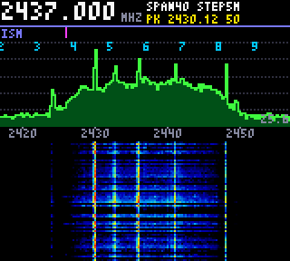 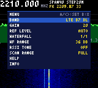

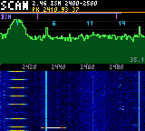 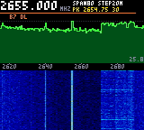

## Tools: cell scanner, BLE, signal identification, DECT, 802.15.4, hunt

Menu > TOOL selects a tool in place of the spectrum views. The tools share the radio, display and
controls services of the application (`app.h`), each has its help page (Menu > HELP). Their DSP
(`dsp.c`, `lte.c`, `ble.c`, `dect.c`, `zigbee.c`, `classify.c`) is hardware independent:
`test/test_sdr_dsp.py` builds it on the host and checks it on synthetic ESP32 captures (8-bit I/Q,
inverted spectrum, noise, frequency offsets).

| Tool | Band | What it does | Verified |
|------|------|--------------|----------|
| Cell scanner | LTE B1/B3/B7/B38/B40/B41/B2/B66 | Carriers found on the band spectrum, LTE cells decoded: PCI, FDD/TDD, PSS correlation, EARFCN, MIB (bandwidth, TX ports, SFN), receiver LO error | On the air (B7 2680.0MHz: PCI 388, FDD, MIB 100 RB/2 TX, LO error +3.0ppm) |
| BLE scanner | 2402/2426/2480MHz | Advertising packets: devices (name, vendor, Apple Continuity type, services), trackers (Find My, SmartTag, Tile, Chipolo, Find Hub), details, find mode (beep per packet) | On the air (HP, Apple Nearby/iBeacon/Find My) |
| Signal ID | 2398-2485MHz | Bursts classified (Wi-Fi 20/40, BLE advertising, 802.15.4, narrowband BT/RC, carriers, 10MHz OFDM drone links, DJI DroneID, analog video, microwave oven), drone link alert, Wi-Fi channels airtime | On the air (Wi-Fi, BLE, narrowband, carriers); drone classes heuristic, no drone here |
| DECT scanner | EU 1880-1900MHz, US 1920-1930MHz | Carriers activity, base stations (RFPI from the beacons), handset transmissions; A-field only (no voice) | Synthetic (no DECT base here) |
| 802.15.4 sniffer | Channels 11-26 | Short frames (1ms captures: ACKs, short data/commands): networks (PAN IDs), Zigbee/6LoWPAN, addresses | Synthetic (no traffic here) |
| Hunt | 1775-2890MHz | Channel power (100kHz-10MHz) gain corrected (auto-ranged manual gain), peak hold, history, tone: interference hunting, direction finding | On the air |
| Wi-Fi scanner | Channels 1-13 | ESP32 Wi-Fi radio (not SDR): access points (SSID, security, signal, clients), stations (associated/probing), channel occupancy (best of 1/6/11), deauth alert | On the air (home/neighbour APs, clients, hidden SSIDs) |

 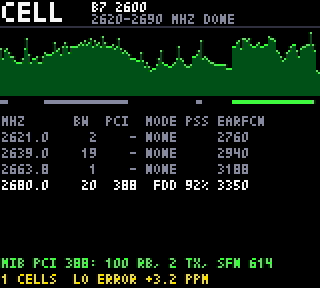

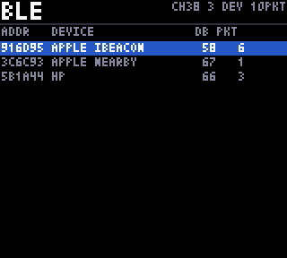 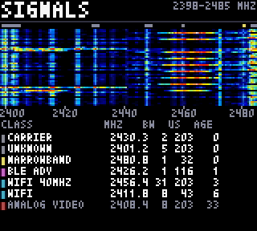

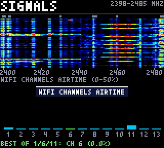 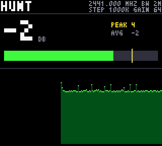

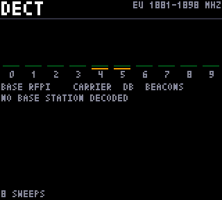 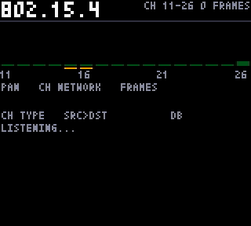

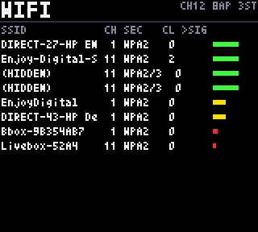 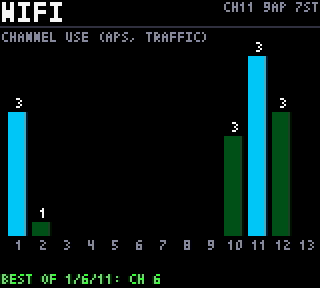

**Cell scanner** (`lte.c`, `tool_cell.c`):
- **Sweep:** wide captures (80MS/s, RX filter opened, flat +-25MHz), 4 averaged per 50MHz step.
- **Carriers:** bins above the floor + 4dB are clustered, bridging gaps < 2MHz. Lightly loaded
  carriers are not flat: only their reference signals fill the unused resource blocks. A cluster
  is centered if it matches an LTE bandwidth, else tiled with the LTE bandwidths.
- **Decode:** 16MS/s captures (1ms) with the carrier 2MHz from DC, channelized to 1.92MS/s
  (polyphase x3/25). The PSS is sent every 5ms: about 1 capture out of 5 contains it.
  - PSS: FFT correlation (2048 points, 3 frequency hypotheses of +-7.5kHz until the LO error is
    known).
  - Refined in the time domain: frequency offset in 500Hz steps, position.
  - SSS: decoded coherently (channel from the PSS), FDD and TDD positions.
  - MIB (PBCH, subframe 0 slot 1): CRS channel estimates of ports 0/1, single port or transmit
    diversity (SFBC, Alamouti), descrambling (4 frame hypotheses), rate dematching (4 repetitions
    per frame), wrap-around Viterbi (K=7, rate 1/3), CRC with the antenna ports mask. Real B7
    captures: 16 MIBs from 47 cell detections, consistent SFNs.
  - Capture timing: the ESP32 handles the commands on its 1ms FreeRTOS tick, so the captures
    started on a 1ms grid of its clock. Against the LTE frame, the PSS was always ~0.8ms into the
    capture and the PBCH (0.35ms after) never fit. The ESP32 fork's `CAPDLY` (random 0-1ms delay
    before each capture, set by the application at start) spreads them.
  - Raster offsets up to +-300kHz tried. Per carrier: 3 detections and the MIB, or 40 captures (60
    once the cell is found).
- **Speed:** 210ms per capture on the VexRiscv (400ms before the LO error is known).
- **LO error:** the console's ESP32 measured at +3.0ppm (8kHz at 2.68GHz).
- **Not decoded:** UMTS carriers (B1 2150MHz here), shown without a PCI.

**BLE scanner** (`ble.c`, `tool_ble.c`):
- **Capture:** channels 37/38/39 in turn, 16MS/s captures (1ms: whole advertising packets,
  <= 376us), channel 2MHz from DC.
- **Demodulation:** channelized to 4MS/s, FM discriminator, access address search (4 sample
  phases, <= 2 bit errors), dewhitening, CRC.
- **Speed:** 71ms per capture, ~10 captures/s. A capture covers ~1% of the air time, so the
  devices appear over tens of seconds.

**Signal ID** (`classify.c`, `tool_signals.c`):
- **Capture:** the ISM band in two 80MS/s halves (2420/2463MHz, +-22MHz used).
- **Spectrogram:** 128-point FFTs with a Hann window (625kHz x 1.6us cells), smoothed over
  12.8us.
- **Bursts:** cells above the per-bin floor + 6dB (capped by the band floor), connected.
  Persistent bins over the captures are receiver spurs/interferers: masked (<= 2 bins) or
  classified as carriers.
- **Classification:** from bandwidth (bins within 12dB of the strongest), duration, channel (Wi-Fi
  centers first, BLE advertising, 802.15.4, DJI DroneID frequencies), continuity and drift.
  Bursts clipped at the band edge are unknown (the LTE B40 TDD carrier below 2400MHz).
- **Drone alert:** needs long bursts (>= 150us) seen twice within 10s (no false alert over the
  tests here).
- **Wi-Fi view:** airtime per channel, least busy of channels 1/6/11.

**Wi-Fi scanner** (`tool_wifi.c`, ESP32 `chromatic_wifi.c`): the one tool that uses the ESP32's own
Wi-Fi demodulator instead of the raw I/Q captures. `WSNIFF <channel> <ms>` puts the ESP32 in
promiscuous mode on a channel for a time, parses the frames and replies with summary lines (access
points, stations, deauthentication frames); the SDR receive setup is restored after. The console
scans channels 1-13 in turn. It decodes complete frames (SSIDs, security from the RSN/WPA elements,
associated stations, beacon/traffic counts) that the raw 1ms captures cannot. Station addresses in
probe requests are often randomized, so they show presence, not a device identity over time.

**DECT** (`dect.c`) and **802.15.4** (`zigbee.c`):
- **DECT:** 4.608MS/s (4 samples/bit) GFSK, S-field sync (RFP/PP, both polarities), A-field
  R-CRC, RFPI from the N_T tails.
- **802.15.4:** 8MS/s (4 samples/chip). O-QPSK half-sine is MSK: the frequency sign of each chip
  interval is `!(c[k] ^ c[k + 1] ^ k odd)`, derived in simulation. Symbols are matched against
  the 16 chip sequences, then preamble/SFD, PHR, PSDU, FCS and the MAC header.

**Performance notes** (VexRiscv, 67MHz, 8KB direct mapped data cache):
- **Interleaved samples:** separate re/im arrays a multiple of 8KB apart evicted each other on
  each access (10x slower). The DSP uses interleaved complex samples, and the buffers accessed
  together are offset in the cache.
- **Optimization:** the DSP is compiled with `-O3 -funroll-loops`. `-Os` stalled on the
  load/multiply latencies: BLE decode 192ms -> 71ms.
- **No 64-bit products:** the FFT uses 32x16-bit products built from 32-bit multiplies, and the
  NCO uses a periodic table for offsets that are multiples of fs/64.

**Limits:**
- **Burst captures:** 1ms at 16MS/s, 205us at 80MS/s, a few per second, so the tools sample the
  air.
- **Short frames:** long 802.15.4 frames (up to 4ms) and complete DECT frames (10ms) don't fit
  in a capture.
- **Decoded layers:** only the unscrambled, unencrypted headers are decoded (LTE sync, BLE
  advertising, DECT A-field, 802.15.4 MAC header).

## Next steps

1. **USB link**: one 512-byte USB packet was lost once in a capture payload in ~13000 relayed
   captures (5000-capture stress test with a slow consumer: no error); the clients resynchronize
   and drop the capture. Root cause (USB IN handshake/host side) still to be found.
2. **Throughput**: per capture, the ESP32 fills/checks its 64KB capture memory and packs it before
   the QSPI writes; continuous ring captures (ESP-SDR ring mode on other chips) would raise the
   duty cycle.
3. **ESP32 duties**: the SDR ESP32 firmware has no menu/OSD/power management: merging the
   transport into the ModRetro MCU firmware (GPL) would keep them (SDR as a mode).
4. **App extras**: recording to the PC from the console buttons; UMTS (P-SCH/CPICH) and 5G NR
   (SSB) detection in the cell scanner; LTE MIB (PBCH: bandwidth, frame number).
